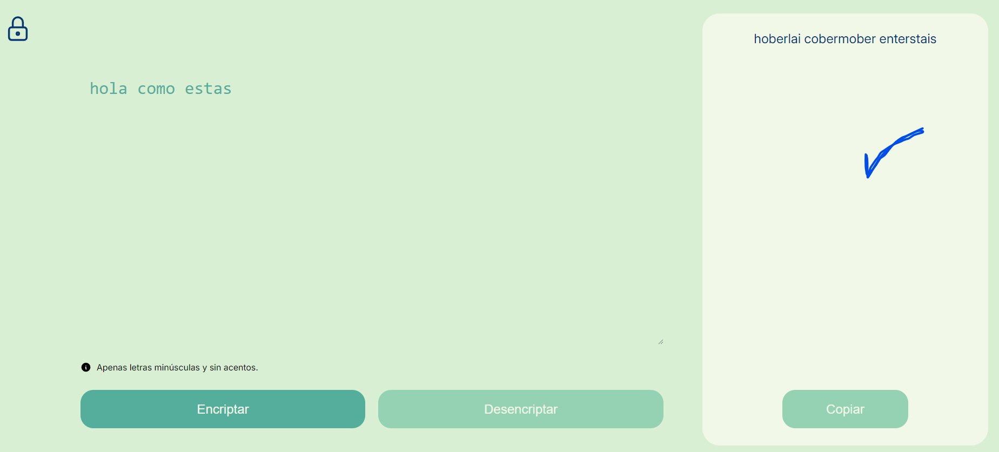
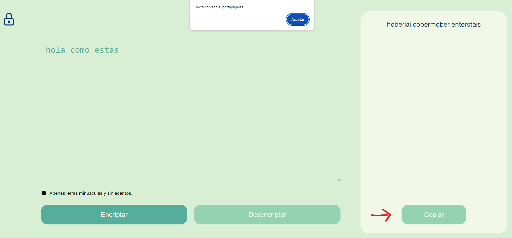
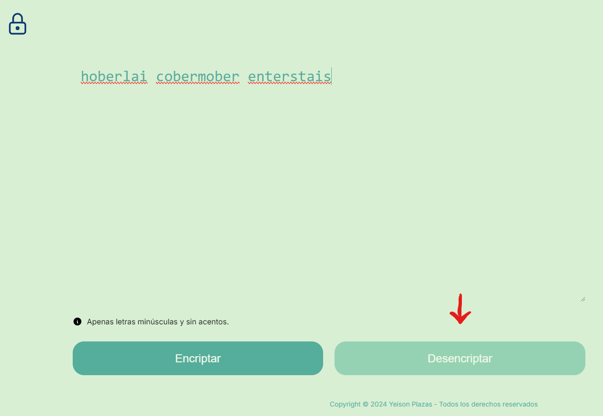
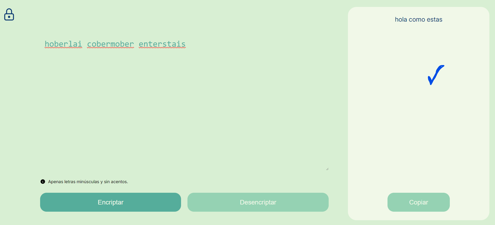

# Encriptador de texto
repositorio del proyecto encriptador de texto, challenge propuesto por Alura Latam.

## funcionalidades del encriptador
1. Encriptar texto
2. Desencriptar texto
3. copiar el resultado de la encriptacion o desencriptación

### Encriptar texto
para encriptar el texto se debe pegar el texto en minusculas y sin caracteres especiales y luego click en el boton encriptar:

el resultado sera el siguiente:

### copiar resultado de la encriptación
para copiar resultado de la encriptación se debe dar click en copiar:

### Desencriptar texto
para desencriptar, se debe pegar el texto copiado anteriormente y luego click en el boton desencriptar:

el resultado sera el siguiente:

